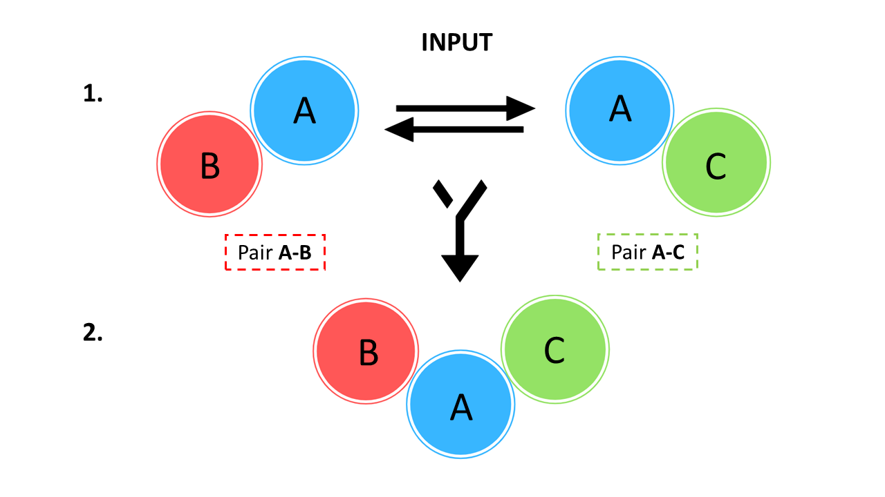
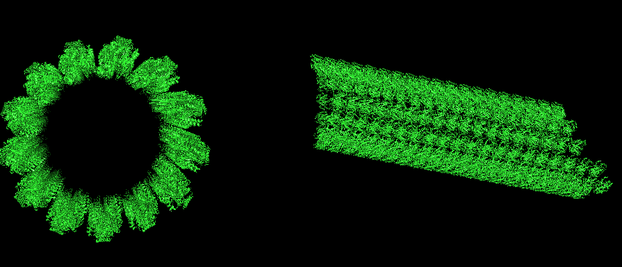
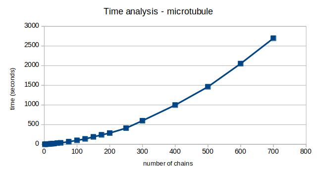
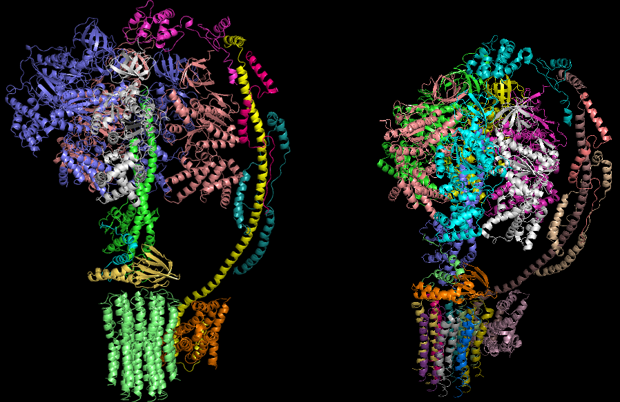

# MacrocomplexBuilder 
## Constructing macromolecular complexes. 

*Pau Badia, Altaïr C.Hernández and Natàlia Segura*

## **Index**

<!-- TOC depthFrom:1 depthTo:6 withLinks:1 updateOnSave:1 orderedList:0 -->
- [Introduction](#Introduction)
- [Background and Scientific explanation](#Background-and-Scientific-explanation)
- [Algorithm implementation](#Algorithm-implementation)
- [Strong Points](#strong-points)
- [Computational Cost](#computational-cost)
- [Limitations](#limitations) 
- [References](#References)
<!-- /TOC -->

### Introduction

Proteins are the most versatil macromolecules in living systems, as are in charge on multitude of specific chemical trasnformations, which provide the cell with usable energy and the molecules needed to form its structure and maintain the intracellular *homeostasis*. Proteins also recieve signals from outside the cell, starting intracellular signal transductions and regulating the gene expression in different stress situations. Sometimes, in order to perform their fucntion, the interaction of several protein subunits is made to form polypeptide complexes. Those structures are known as the quaternary structure of a protein, in which each subunit is atomically stabilized by hydrogen bonds or disulfide bonds, as well as other non bonding interactions (electrostatic and Van der Waals). Some examples are the hemoglobin, the ATP syntase, the RNA polymerase or the ribosome. 

Nevertheless, understanding how proteins interact with others in the assembly process is not an easy task. For this reason, different research groups have developed methods that predict how this interaction may occur. In the Protein Data Bank (PDB) are stored a large set of proteins with known structure, after a process of x-ray crystallography or Nuclear Magnetic Ressonance (NMR), allowing us to study the molecular space and possible allosteric interactions. 

It is important to stand out that there are some proteins that are difficult to crystallize due to its molecular conformation or dimensionallity, such as virus capsides. In other cases, it could be found some other type of interactions like protein/DNA, protein/RNA, DNA/DNA and/or RNA/RNA interactions, and it could be an interesting feature to study in transcriptional or translational processes (it would be the case of ribosomes, for instance). 

The main scope of this project is to reconstruct protein macrocomplexes from individual protein pairwise interactions using Bioinformatic resources. In order to do so, we have developed a stand-alone application that reads a set of protein - protein interactions in PDB file format and reconstruct different multi-subunit complexes. In this report we explain the approach we implement in order to make the program efficient and biologically reasonable. 

## Background and Scientific explanation

Macrocomplexes are built with an specific spatial order of subunits interacting with other subunits, and are usually stabilized by an hydrophobic core. This means that proteins interact between them with residues that don't like water (hydrophobic), and as a counterpart expose to the solvent those other residues that do like water (hydrophilic).

>

If we start from scratch to reconstruct a complex of subunits we need to know at least the number of chains that will build that macrostructure. 

In protein macrocomplexes there are several chains that interact with more than one chain, allowing the rest of interactions to be done. We could start by taking one of these pair interactions as a template (i.e. A-B), and then superimpose the rest of the interactions by protein superposition. We have to assume that at least one chain of the template interact with another subunit (in this example A-C). This way we could superpose those identical chains (A-A) and move the new pair interaction to the template. Therefore, we would obtain a resulting structure of three chains (*Figure 1*). If we repeat this process until all the simillar chains are superposed, then we would obtain the final macrocomplex.

In order to carry this out we should know the order in which the program would have to superpose these pair of interactions. The order is needed to avoid clashes between chains or even to prevent the program to superimpose the same chain more than once. Also, we should know how many iterations the program would have to achive in order to make the final structure. 

This could be solved in different ways. For instance, starting with one pair of interactions as template it could check all the possible interactions in each iteration an see which candidate would satisfy the problem statement. This approach is called exhaustive search algorithm. Although this approach would be the simplest and easiest to implement, it would have a computational cost proportional to the number of candidate solutions, which would tend to grow in exponentially.  

Below is explained how did we deal with this problem, as well as the approach we followed.

  
### Algorithm implementation

We approached the exhaustive search algorithm by focusing on the interacting residues of each subunit. If we imagine the whole macrocomplex structure as a lego puzzle, then we would realize that each chain has some residues that are interacting with at least another chain (*hydrophobic residues*) and the rest of the residues that are exposed to the solvent environment (*hydrophilic residues*). 

Basing on that premise, we store the interacting residues for each chain, as well as the corresponding chain those residues are interacting with. We did this by looking for those residues that are in no larger that 3,5 Amstrongs distance. In that way force the program to check in each iteration/superimposition whether those residues are interacting or not. At the same time, we consider as feasible complexes those that have no clashes when superimposed, which means that the backbone of the model that is been superimopsed is not interacting with the rest of the complex already joined, with a threshold distance of 2 Amstrongs.   

Then, our program would start to structurally superimpose structures with at least two identical subunits (those that share a pairwise sequence identity bigger or equal to 95%). For each model the program knows how many interacting sites are in each protein, and even with which specific chain has to interact on those sites. 

And know, when we read the PDB files, for each chain we load into memory the interacting residues. Besides, we store in the same set which is the model of the corresponding interaction, so that we know which is the model to superimpose later. At the end we obtain a dictionary with each chain as key and all the information as values: interacting residues, interacting chain pair names and interacting residues for the other chain. Once this repository is made, we make a function in order to update the interaction dictionary of each chain, in order to ensure that all the interactions are corrcetly collected in it. One point to remark is that when the updating is done, in case of finding an interaction already saved in the dictionary, this is not inserted again.

The superimposition starts with the chain with more interactions, to avoid starting for a wrongly given interaction that just interact with itself. Once the initial model is chosen, we implemented a random behavior to allow the rest of models to be randomly added. One of the main aspects of our approach that makes it as fast is the use of an internal check list when the superposing occurs. This allow the program to know, for each chain, which interactions are done and which ones are still remain to be checked and superimposed. However, if a chain appears more than once in the complex, each of them will have its checklist to complete. That way we ensure that all interactions are correctly done.

This approach works also with DNA and RNA interactions, as we just checked the atomic position of each structure. The only thing we did is a function to store the DNA or RNA sequence and, from that, the main loop manage to build the whole structure.

## Computational cost

One of the main limitations dealing with the creation of a macrocomplex is the number of atoms and number of interactions it has. That's why we did a deeper anaylisis of these two factors using the microtuble folder. What is advantatgeous about this macrocomplex is that without any limitations it can go on forever without stopping, more or less like in a cell. But, limiting its parameters, it enables us to analyse our program.

We did a series of tests normalizing by number of atoms and interactions. The microtuble has two different chains, with an average of 3347 atoms and 4 interactions by chain. 

>  

Thanks to the illimited number of chains input that we can test when creating the microtuble we can asses its growing time curve. As it can be seen in the following graph, it might seem that until 200 chains the program followed a linear tendency but when a bigger number of calculations and steps was needed to create the microtuble, i.e. more chains, this behaviour is proven wrong. In fact, the program really follows an exponential curve. The more atoms/iterations it has to check, the more time it needs to run in an exopenential way.

>

### Strong Points

*1*. **Dynamic programming implementation**

The algorithm is based in a dynamic programming implementaton, in such a way that the final output is retrived in a very short time. This is due to the fact tha we use the interactions between chains as a previous knowlege to solve the final problem (*see documentation*). 

*2*. **Input managing**

  - The input names does not affect to the output (i.e. if all PDB files are named XY.pdb).
  - The input does not need all the interactions in different PDB files (i.e. case of virus capside or microtuble, with more than 150 chain-interaction in the case of the virus capside, and infinite interactions in the microtuble).
  - If the user gives a non-existing or wrong interaction the program ignores it and keeps going.

*3*. **Obtain different models**

Possibility to generate different models in a very short time. This allow the user to compare each model and decide which is/are the best models. Different models are scored in an output file.

*4*. **Launching the program with GUI**

MacrocomplexBuilder can be launched from command line or with the **Graphical User Interface** (GUI). Besides, the GUI offer the advantatge to obtain a Pymol image of the final model, without the requirement of opening pymol.

*5*. **DNA & RNA interactions**
 
Possibility to model DNA/DNA, RNA/RNA, DNA/RNA, DNA/protein and RNA/protein interactions and retrieve a quick output (i.e. when modeing the ribosome).

*6*. **Modifiable number of chains in the final model**

Possibility to limit the number of chains when executing the program. Besides, if the user specifies that wants the macrocomplex with 7 chains but in fact the model has only 4 chains (i.e. Hemoglobin), it will not try to put more just because it was asked. This limited and reduces very much the program performance time.

*7*. **Heteroatoms and water matter**

The active site of a protein often is composed by anions and cations. This information is described in the heteroatoms. MacrocomplexBuilder can use the heteroatom and water coordinates and information to construct the macrocomplex so we are not losing biological information. 

## Limitations

*1*. **Increase of the computational cost with number of atoms in macrocomplex**

As it can be seen in the *Figure 3*, the programs follows an exponential curve. The more atoms and interactions it has to check, the longer it takes to process.

*2*. **Microtuble modeling**

Another factor that limit our program is that, due to some aspects of our approach, some "infinite" structures are not modeled as expected, like the microtuble. This is possibly due to a random behavior implemented in the algorithm when adding subunits to the macrocomplex. 

*3*. **Different solutions**

Although the program can be asked to build more than one model from the same input, it is not able to deduce and build more than one output when there could be more than one possible solution. 

*4*. **The ATP problem and global stechiometry**

The problem with these macrocomplex is the number of interactions it has and the program can't handle all of them to create it. A way to modify the algorithm approach to be able to construct correctly these macrocomplex is by givin stechiometry into the programm. That way, we limit the interactions and we force the macrocomplex into a specific shape. This can be achived using the optional argument -s (stechiometry). We give to the program the global macrocomplex stechiometry and it will build it using this parameters. A clear disatvantage of it is that even with the correct stechiometry it doesn't construct the right way (*Figure4*).

> 

## Next Steps

*What could be the next future improvements?*

*1*. **Model Energy Minimization**

It could be implemented an option of energy optimization to a local energy minimum by molecular dynamics once the model/s has been finished. Protein structures often have errors of various magnitude: atoms overlapping, wrong side chain orientation (lack of water molecules when modeling). An energy minimization would look for the pathway that reduces the most in the overall energy of the system, obtaining a best approach of the final structure if possible. It could be reached with programs as **Amber**, that combines molecular mechanical force fields with biomolecular simularions. 
 
*2*. **Microtuble modeling**

It would be a good point to modify the algorithm approach which could improve the correct shape of the microtuble, as well as other non limit structures. We think that a way to do it could be to fisrt itearte the program by chain interactions as it does, but and, at a certain time force it to start again, but adding those interactions that had not been added yet.  

*3*. **ATP Synthase modeling**

The problem with these macrocomplex is the number of interactions it has and the program can't handle all of them to create it. A way to modify the algorithm approach to be able to construct correctly these macrocomplex is by givin stechiometry into the programm. That way, we limit the interactions and we force the macrocomplex into a specific shape. One way to do it could be that given a template, the program calculates the stechiometry and use it to create the model.

### References

Since our project needed a way to determine if two residues where interacting or to check if a clash had been produced, we used the following values from the following references:

* In each interaction pair we store the atoms from each chain that interacts with the other. Since many PDB files lack hydorgen bonds, the presence of an hydrogen bond can be inferred when an atom from one chain is within 3.5 Amstrongs of an atom of the other chain.  
Martz, Eric; Help, Index & Glossary for Protein Explorer, http://www.umass.edu/microbio/chime/pe_beta/pe/protexpl/igloss.htm
Jeffrey, George A.; An introduction to hydrogen bonding, Oxford University Press, 1997.

* Before two chains are superimposed, in order to determinate if they will be or not, we will check if they have clashes. The threshold that we use is by measuring the atomic distance. If the distance is 2 Amstrongs or less and there is more than a 3% of the alpha carbons atoms in proteins and the carbon one in nucleic acid atoms has clashes we will not superpose them.  
Values of Vanderwalls radius taken from: http://ww2.chemistry.gatech.edu/~lw26/structure/molecular_interactions/mol_int.html
Batsanov S.S.; Van der Waals Raddi of Elements, Inorganic Materials, 2001.

